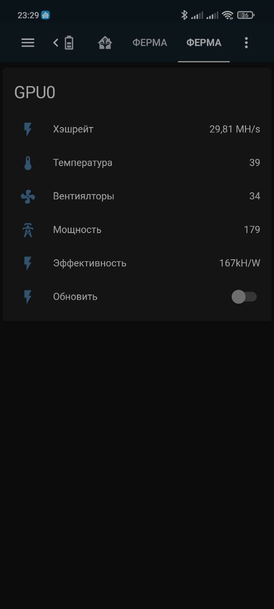
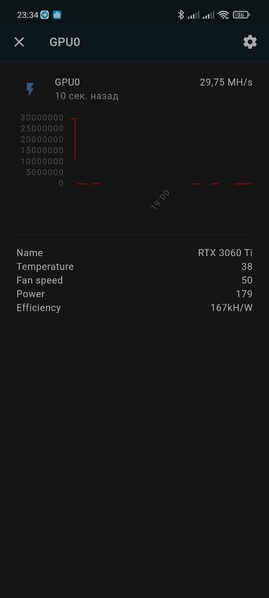
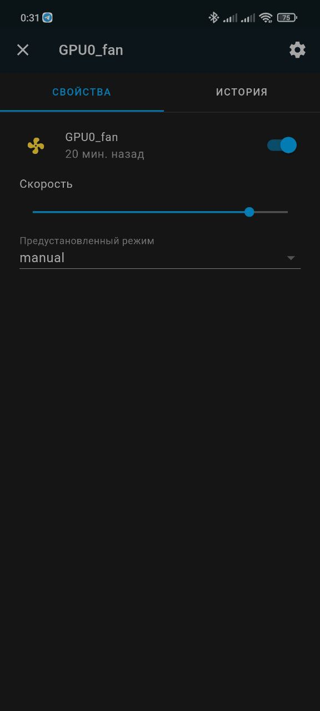

# Miner2MQTT

Доступ к вашему GPU майнеру через MQTT.

  

## Изменения

<details>
  <summary>1.0</summary>

- EXE файл для Windows
</details>
<details>
  <summary>1.1</summary>

- Управление вентиляторами видеокарт (Linux)

- Упраление power limit видеокарт (требуется SU) (Linux)
</details>

## Описание

**Поддерживаемые ОС**

- Linux
- Windows (не тестировалось)

**Поддерживаемые майнеры**

- T-Rex

**Воможности:**
- Публикация всей информации от майнера в MQTT
- Возможность выборочной публикации (`INCLUDE` и `EXCLUDE` параметры в `config.yaml`)
- Обновление с указанным интервалом или по требованию (путем публикации `"ON"` в `ваш_топик/to_miner/refresh`)
<details>
  <summary>Управление вентиляторами видеокарт</summary>

- Изменение скорости: публикация значения в процентах в топик `ваш_топик/to_miner/<GPU_number>/fan_speed`, топик с текущими значениями в процентах `ваш_топик/from_miner/<GPU_number>/fan_speed`. 
- Включение вентилятора: публикация значения `ON` в топик `ваш_топик/to_miner/<GPU_number>/fan_state`, топик с текущим состоянием `ваш_топик/from_miner/<GPU_number>/fan_state`.
- Изменение режима auto/manual: публикация значения `auto` / `manual`в топик `ваш_топик/to_miner/<GPU_number>/fan_mode`, топик с текущим режимом `ваш_топик/from_miner/<GPU_number>/fan_mode`.
</details>
<details>
  <summary>Управление power limit видеокарт</summary>

- Изменение power limit: публикация значения в процентах в топик `ваш_топик/to_miner/<GPU_number>/power_limit`, топик с текущими значениями в процентах `ваш_топик/from_miner/<GPU_number>/power_limit`. 
- Для изменения power limit требуются права SU, необходимо либо вписать `SUDO_PASS` в `config.yaml` либо запускать `m2m.py` с правами sudo.
</details>


## Установка:

  <summary>Ubuntu </summary>
  
  ```bash
  sudo apt install python3-setuptools
  git clone https://github.com/bds89/miner2mqtt.git
  cd miner2mqtt
  sudo python3 setup.py install   
  gedit m2m/config.yaml   #Редактируем config.yaml
  ```

## Запуск:
  ```bash
  python3 m2m/m2m.py
  ```

## Обновление:
- Сохраните ваш config.yaml
  ```bash
  cd miner2mqtt
  git pull origin
  ```
- Скопируйте ваш сохраненный `config.yaml` в `miner2mqtt/m2m`
  
## Редактирование config.yaml:
```yaml
MINER: Trex
    #выбор GPU майнера, на данный моменр только T-rex
SUDO_PASS: pass
<<<<<<< HEAD
    #Пароль SUDO
=======
    #пароль суперпользователя, для изменения power_limit
>>>>>>> 841cf104de781b5082350924c14c542a6e909d9c
MQTT:
  TOPIC: miner2mqtt/rig0
  HOST: 192.168.0.120
  USERNAME: user
  PASS: pass
    #Подключение к вашему MQTT
INTERVAL: 300
    #интервал сбора и публикации информации в секундах
INCLUDE:
- active_pool
- gpus
EXCLUDE: {}
    #фильтры по ключам из JSON словаря вашего майнера (поддерживаются только ключи первого уровня)
```

## Примеры интеграции в Home Asistant:
<details>
  <summary>Сборный сенсор GPU0</summary>

```yaml
sensor:
  - platform: mqtt
    name: "GPU0"
    state_topic: "miner2mqtt/rig0"
    unit_of_measurement: "MH/s"
    value_template: "{{ (value_json.gpus.0.hashrate_minute/1000000)|round(2) }}"
    device_class: power
    expire_after: 660
    json_attributes_topic: "miner2mqtt/rig0"
    json_attributes_template: >
      { "name": "{{value_json.gpus.0.name}}",
        "temperature": "{{value_json.gpus.0.temperature}}",
        "fan_speed": "{{value_json.gpus.0.fan_speed}}",
        "power": "{{value_json.gpus.0.power}}",
        "efficiency": "{{value_json.gpus.0.efficiency}}" }
```
</details>
<details>
  <summary>Отдельные сенсоры</summary>

```yaml
sensor:
  - platform: mqtt
    name: "GPU0_hash"
    state_topic: "miner2mqtt/rig0"
    unit_of_measurement: "MH/s"
    value_template: "{{ (value_json.gpus.0.hashrate_minute/1000000)|round(2) }}"
    device_class: power
    expire_after: 660
    json_attributes_topic: "miner2mqtt/rig0"

  - platform: mqtt
    name: "GPU0_name"
    state_topic: "miner2mqtt/rig0"
    value_template: "{{value_json.gpus.0.vendor|string + ' '|string + value_json.gpus.0.name|string}}"
    json_attributes_topic: "miner2mqtt/rig0"
    
  - platform: mqtt
    name: "GPU0_temperature"
    state_topic: "miner2mqtt/rig0"
    unit_of_measurement: "°C"
    value_template: "{{value_json.gpus.0.temperature}}"
    expire_after: 660
    json_attributes_topic: "miner2mqtt/rig0"
    
  - platform: mqtt
    name: "GPU0_fan_speed"
    state_topic: "miner2mqtt/rig0"
    unit_of_measurement: "%"
    value_template: "{{value_json.gpus.0.fan_speed}}"
    device_class: power_factor
    expire_after: 660
    json_attributes_topic: "miner2mqtt/rig0"
    
  - platform: mqtt
    name: "GPU0_power"
    state_topic: "miner2mqtt/rig0"
    unit_of_measurement: "kW/h"
    value_template: "{{value_json.gpus.0.power}}"
    device_class: power
    expire_after: 660
    json_attributes_topic: "miner2mqtt/rig0"   
    
  - platform: mqtt
    name: "GPU0_efficiency"
    state_topic: "miner2mqtt/rig0"
    unit_of_measurement: "kH/W"
    value_template: "{{value_json.gpus.0.efficiency.split('kH/W')[0]|int}}"
    device_class: power
    expire_after: 660
    json_attributes_topic: "miner2mqtt/rig0" 
```
</details>
<details>
  <summary>Кнопка обновить</summary>

```yaml
switch:
  - platform: mqtt
    unique_id: m2m_refresh
    name: "m2m_refresh"
    state_topic: "miner2mqtt/rig0/to_miner/refresh"
    command_topic: "miner2mqtt/rig0/to_miner/refresh"
    payload_on: "ON"
    payload_off: "OFF"
    state_on: "ON"
    state_off: "OFF"
```
</details>
<details>
  <summary>Вентилятор</summary>

```yaml
fan:
  - platform: mqtt
    name: "GPU0_fan"
    state_topic: "miner2mqtt/rig0/from_miner/0/fan_state"
    command_topic: "miner2mqtt/rig0/to_miner/0/fan_state"
    percentage_state_topic: "miner2mqtt/rig0/from_miner/0/fan_speed"
    percentage_command_topic: "miner2mqtt/rig0/to_miner/0/fan_speed"
    preset_mode_state_topic: "miner2mqtt/rig0/from_miner/0/fan_mode"
    preset_mode_command_topic: "miner2mqtt/rig0/to_miner/0/fan_mode"
    preset_modes:
      -  "auto"
      -  "manual"
```
</details>
<details>
  <summary>Power limit видеокарты (вариант light.)</summary>

```yaml
light:
  - platform: mqtt
    name: "GPU0_power_limit"
    state_topic: "miner2mqtt/rig0/from_miner/0/state"
    command_topic: "miner2mqtt/rig0/to_miner/0/state"
    icon: mdi:lightning-bolt-circle
    brightness_scale: 240
    max_mireds: 240
    min_mireds: 100
    brightness_state_topic: "miner2mqtt/rig0/from_miner/0/power_limit"
    brightness_command_topic: "miner2mqtt/rig0/to_miner/0/power_limit"
```
</details>
<details>
  <summary>Power limit видеокарты (вариант number.)</summary>

```yaml
number:
  - platform: mqtt
    name: "GPU0_power_limit"
    state_topic: "miner2mqtt/rig0/from_miner/0/power_limit"
    command_topic: "miner2mqtt/rig0/to_miner/0/power_limit"
    icon: mdi:lightning-bolt-circle
    min: 100
    max: 240
```
</details>

## Планы
- Windows
- Управление майнером
- NBMiner
