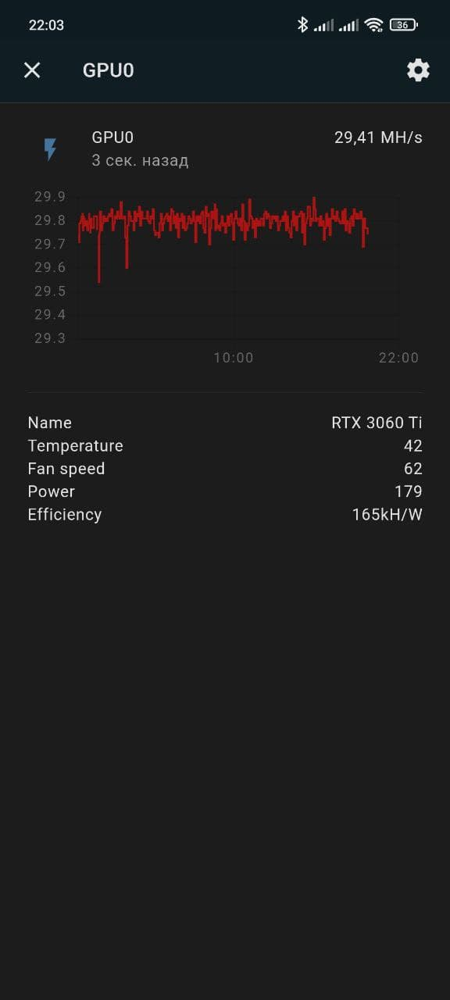

# Miner2MQTT

Доступ к вашему GPU майнеру через MQTT либо мобильное приложение ([miner2android](https://github.com/bds89/miner2android))

  

## Изменения

<details>
  <summary>1.0</summary>

- EXE файл для Windows
</details>
<details>
  <summary>1.1(Linux)</summary>

- Управление вентиляторами видеокарт (Linux)

- Упраление power limit видеокарт (требуется SU) (Linux)
</details>
<details>
  <summary>1.2(Linux)</summary>

- Поддержка `danila miner` для майнинга `TON`. (Майнер запускается m2m.py, поэтому необходимо прописать команду для запуска в `config.yaml`. Хэшрейт для нескольких видеокарт будет одинаковым(общим))

- Вывод дополнительных системных параметров: `USED_RAM`, `CPU_temp`, `CPU_freq`, `CPU_FAN`. (если использовали параметр `INCLUDE` в `config.yaml`, необходимо в него добавить: `sys_params`)

- Исправление работы регулировки вентиляторов видекарт с двумя и тремя вентиляторами. (Для видеокарт с одним вентилятором возможны проблемы, не на чем протестировать)
</details>
<details>
  <summary>1.3(Linux)</summary>

- Поддержка APIKEY для  Trex. Не обязательный параметр `TrexAPIPASS` в `config.yaml`
- Поддержка API адреса для Trex. Не обязательный параметр `TrexAPI` в `config.yaml`
</details>
<details>
  <summary>1.4</summary>

- Поддержка lol-miner
(необходима переустановка m2m либо ручная установка фреймворка flask(pip install flask))
</details>
<details>
  <summary>1.5</summary>

- Поддержка [miner2android](https://github.com/bds89/miner2android)
- (необходима переустановка m2m либо ручная установка waitress(pip install waitress))
- (Для включения поддержки мобильного приложения в `config.yaml`необходимо добавить параметр `APP`)

<details>
  <summary>1.5.1</summary>

- Уведомления для [miner2android](https://github.com/bds89/miner2android). Ваша ферма следит за параметрами компьютера с интервалом `INTERVAL` в `config.yaml`, а затем отдает их приложению. (нет необходимости обновлять, если вы не используете [miner2android](https://github.com/bds89/miner2android))
</details>
<details>
  <summary>1.5.2</summary>

- Графики изменения величин для [miner2android](https://github.com/bds89/miner2android). Если в `config.yaml` включен параметр `APP` будет создана база данных `values.db` хранящая значения всех величин с начала предыдущих суток с интервалом `INTERVAL`. (нет необходимости обновлять, если вы не используете [miner2android](https://github.com/bds89/miner2android))
</details>
<details>
  <summary>1.5.3</summary>

- Исправление ошибок для [miner2android](https://github.com/bds89/miner2android) и `lol-miner`
</details>
<details>
  <summary>1.5.4</summary>

- При изменении мощности видекарты, скорости вентиляторов, режима вентилятора(авто, ручной), значения сохраняются и применяются при перезапуске.
</details>
</details>


## Описание

**Поддерживаемые ОС**

- Linux
- Windows (без управления)

**Поддерживаемые майнеры**

- T-Rex
- danila miner
- lol miner

**Воможности:**
- Публикация всей информации от майнера в MQTT
- Возможность выборочной публикации (`INCLUDE` и `EXCLUDE` параметры в `config.yaml`)
- Обновление с указанным интервалом или по требованию (путем публикации `"ON"` в `ваш_топик/to_miner/refresh`)
<details>
  <summary>Управление вентиляторами видеокарт (version 1.1+)</summary>

- Изменение скорости: публикация значения в процентах в топик `ваш_топик/to_miner/<GPU_number>/fan_speed`, топик с текущими значениями в процентах `ваш_топик/from_miner/<GPU_number>/fan_speed`. 
- Включение вентилятора: публикация значения `ON` в топик `ваш_топик/to_miner/<GPU_number>/fan_state`, топик с текущим состоянием `ваш_топик/from_miner/<GPU_number>/fan_state`.
- Изменение режима auto/manual: публикация значения `auto` / `manual`в топик `ваш_топик/to_miner/<GPU_number>/fan_mode`, топик с текущим режимом `ваш_топик/from_miner/<GPU_number>/fan_mode`.
</details>
<details>
  <summary>Управление power limit видеокарт (version 1.1+)</summary>

- Изменение power limit: публикация значения в процентах в топик `ваш_топик/to_miner/<GPU_number>/power_limit`, топик с текущими значениями в процентах `ваш_топик/from_miner/<GPU_number>/power_limit`. 
- Для изменения power limit требуются права SU, необходимо либо вписать `SUDO_PASS` в `config.yaml` либо запускать `m2m.py` с правами sudo.
</details>

**Примечания:**
- danila-miner не предоставляет информации по каждой карте отдельно. В ваш топик будут публиковаться одинаковые суммарные значения хэшрейта для каждой карты
- danila-miner не предоставляет информации о состоянии видекарты(температура, обороты вентиляторов, мощность), для Linux значения будут браться из nvidia-smi, для Windows эти значения будут пустыми.
- для получения информации от lol-miner в его скрипте, необходимо включить API (например: --apiport 4067 --apihost 127.0.0.1)
- для Windows, если используете параметр `lol_command` в скрипте майнера желательно прописать к нему абсолютный путь (например: "C:\Users\bds89\Downloads\lolMiner_v1.44_Win64\1.44\lolMiner.exe") либо располажить майнер на диске С.

## Установка:

  <summary>Ubuntu </summary>
  
  ```bash
  sudo apt install python3-setuptools
  git clone https://github.com/bds89/miner2mqtt.git
  cd miner2mqtt
  sudo python3 setup.py install   
  gedit m2m_Linux/config.yaml   #Редактируем config.yaml
  ```

## Запуск:
  ```bash
  python3 m2m_Linux/m2m.py
  ```

## Обновление:
- Сохраните ваш config.yaml
  ```bash
  cd miner2mqtt
  git pull origin
  ```
- Скопируйте ваш сохраненный `config.yaml` в `miner2mqtt/m2m_Linux`
  
## Редактирование config.yaml:
```yaml
MINER: Trex/danila-miner/lol-miner
    #выбор GPU майнера (не обязательно)
danila_command: "/home/ferma2/TON_miner/danila-miner run https://server1.whalestonpool.com your_walet_adress"
    #Команда для запуска danila-miner(*обязательно, если используется `danila-miner`)
lol_command: /home/bds89/lolMiner_v1.44_Lin64/1.44/dual_mine_eth_ton.sh
    #Команда для запуска lol-miner(не обязательно, при запуске майнера скриптом m2m в mqtt будет передаваться дополнитльный параметр `lhrtune`)
TrexAPI: http://127.0.0.1:4067
    #адрес API для Trex майнера, если отличается от стандартного
TrexAPIPASS: YourWebGuiPassword
    #ваш пароль для Trex майнера
lolAPI: http://127.0.0.1:4067
    #адрес API для lol майнера (обязательно если ипользуется `lol-miner`)
SUDO_PASS: pass
    #пароль суперпользователя, для изменения power_limit, только для Linux
MQTT: #(не обязательно, если используете только для мобильного приложения, этот блок можно убрать)
  TOPIC: miner2mqtt/rig0
  HOST: 192.168.0.120
  USERNAME: mqttuser
  PASS: mqttpass
    #Подключение к вашему MQTT
INTERVAL: 120s
    #интервал сбора и публикации информации в секундах (*обязательно)
INCLUDE:
- active_pool
- gpus
- sys_params
EXCLUDE: {}
    #фильтры по ключам из JSON словаря вашего майнера (поддерживаются только ключи первого уровня)
APP: #(не обязательно, если используете только для публикации в MQTT, этот блок можно убрать)
  IP_FLASK: 192.168.0.101 #IP вашего компьютера в локальной сети, обязательно для Windows, для Linux скрипт попытается найти самостоятельно 
  PORT_FLASK: 5000 #(не обязательно)
  SLAVE_PC: false #(не обязательно, если данный компьютер будет подключаться к мобильному приложению чере другой компьютер, укажите `true`)
  SESSIONKEY: "1111" #любой набор символов(не обязательно, при отсутствии будет использоваться литерал из кода)
  PASS: "mobileAppPass" #пароль для подключения мобильного приложения (*не обязательно)
```
## Примеры публикации в MQTT:
Публикация в mqtt будет отличаться в зависимости от майнера, вы можете посмотреть ее, подписавшись на свойтопик/# в HomeAssitant, ниже приведен пример публикации в mqtt, не зависящеей от выбранного майнера
<details>
  <summary>Общая публикация</summary>

```json
{
    "hashrate": 43051985.1,
    "hashrate2": 904308856.7,
    "gpus": [
        {
            "device_id": 0,
            "fan_speed": 40,
            "name": "NVIDIA GeForce RTX 3060 Ti",
            "temperature": 39,
            "power": 164.548,
            "vendor": "",
            "hashrate": 43050000,
            "efficiency": 261625.78700439993,
            "hashrate2": 904310000,
            "efficiency2": 261625.78700439993,
            "hashrate_minute": 42707500,
            "hashrate_minute2": 902945000,
            "hashrate_hour": 39010434.78,
            "hashrate_hour2": 720106956.52
        }
    ],
    "sys_params": {
        "used_ram": 10.5,
        "cpu_temp": 32,
        "cpu_freq": 1277,
        "cpu_fan": "no fan"
    }
}
```
hashrate2 - хэшрейт второго алгоритма при дуал майнинге. Если вы работает с одним алгоритмом, эти значения будут равны 0.
</details>

## Примеры интеграции в Home Asistant:
<details>
  <summary>Сборный сенсор GPU0</summary>

```yaml
sensor:
  - platform: mqtt
    name: "GPU0"
    state_topic: "miner2mqtt/rig0"
    unit_of_measurement: "MH/s"
    value_template: "{{ (value_json.gpus.0.hashrate_minute|float/1000000)|round(2) }}"
    device_class: power
    expire_after: 660
    json_attributes_topic: "miner2mqtt/rig0"
    json_attributes_template: >
      { "name": "{{value_json.gpus.0.name}}",
        "temperature": "{{value_json.gpus.0.temperature}}",
        "fan_speed": "{{value_json.gpus.0.fan_speed}}",
        "power": "{{value_json.gpus.0.power}}",
        "efficiency": "{{value_json.gpus.0.efficiency}}" }
```
</details>
<details>
  <summary>Отдельные сенсоры</summary>

```yaml
sensor:
  - platform: mqtt
    name: "GPU0_hash"
    state_topic: "miner2mqtt/rig0"
    unit_of_measurement: "MH/s"
    value_template: "{{ (value_json.gpus.0.hashrate_minute|float/1000000)|round(2) }}"
    device_class: power
    expire_after: 660
    json_attributes_topic: "miner2mqtt/rig0"

  - platform: mqtt
    name: "GPU0_name"
    state_topic: "miner2mqtt/rig0"
    value_template: "{{value_json.gpus.0.vendor|string + ' '|string + value_json.gpus.0.name|string}}"
    json_attributes_topic: "miner2mqtt/rig0"
    
  - platform: mqtt
    name: "GPU0_temperature"
    state_topic: "miner2mqtt/rig0"
    unit_of_measurement: "°C"
    value_template: "{{value_json.gpus.0.temperature}}"
    expire_after: 660
    json_attributes_topic: "miner2mqtt/rig0"
    
  - platform: mqtt
    name: "GPU0_fan_speed"
    state_topic: "miner2mqtt/rig0"
    unit_of_measurement: "%"
    value_template: "{{value_json.gpus.0.fan_speed}}"
    device_class: power_factor
    expire_after: 660
    json_attributes_topic: "miner2mqtt/rig0"
    
  - platform: mqtt
    name: "GPU0_power"
    state_topic: "miner2mqtt/rig0"
    unit_of_measurement: "kW/h"
    value_template: "{{value_json.gpus.0.power}}"
    device_class: power
    expire_after: 660
    json_attributes_topic: "miner2mqtt/rig0"   
    
  - platform: mqtt
    name: "GPU0_efficiency"
    state_topic: "miner2mqtt/rig0"
    unit_of_measurement: "kH/W"
    value_template: "{{value_json.gpus.0.efficiency.split('kH/W')[0]|int}}"
    device_class: power
    expire_after: 660
    json_attributes_topic: "miner2mqtt/rig0" 
```
</details>
<details>
  <summary>Кнопка обновить</summary>

```yaml
switch:
  - platform: mqtt
    unique_id: m2m_refresh
    name: "m2m_refresh"
    state_topic: "miner2mqtt/rig0/to_miner/refresh"
    command_topic: "miner2mqtt/rig0/to_miner/refresh"
    payload_on: "ON"
    payload_off: "OFF"
    state_on: "ON"
    state_off: "OFF"
```
</details>
<details>
  <summary>Вентилятор</summary>

```yaml
fan:
  - platform: mqtt
    name: "GPU0_fan"
    state_topic: "miner2mqtt/rig0/from_miner/0/fan_state"
    command_topic: "miner2mqtt/rig0/to_miner/0/fan_state"
    percentage_state_topic: "miner2mqtt/rig0/from_miner/0/fan_speed"
    percentage_command_topic: "miner2mqtt/rig0/to_miner/0/fan_speed"
    preset_mode_state_topic: "miner2mqtt/rig0/from_miner/0/fan_mode"
    preset_mode_command_topic: "miner2mqtt/rig0/to_miner/0/fan_mode"
    preset_modes:
      -  "auto"
      -  "manual"
```
</details>
<details>
  <summary>Power limit видеокарты (вариант light.)</summary>

```yaml
light:
  - platform: mqtt
    name: "GPU0_power_limit"
    state_topic: "miner2mqtt/rig0/from_miner/0/state"
    command_topic: "miner2mqtt/rig0/to_miner/0/state"
    icon: mdi:lightning-bolt-circle
    brightness_scale: 240
    max_mireds: 240
    min_mireds: 100
    brightness_state_topic: "miner2mqtt/rig0/from_miner/0/power_limit"
    brightness_command_topic: "miner2mqtt/rig0/to_miner/0/power_limit"
```
</details>
<details>
  <summary>Power limit видеокарты (вариант number.)</summary>

```yaml
number:
  - platform: mqtt
    name: "GPU0_power_limit"
    state_topic: "miner2mqtt/rig0/from_miner/0/power_limit"
    command_topic: "miner2mqtt/rig0/to_miner/0/power_limit"
    icon: mdi:lightning-bolt-circle
    min: 100
    max: 240
```
</details>

## Планы
- Windows
- cpuminer-gr-avx2
- Android APP
